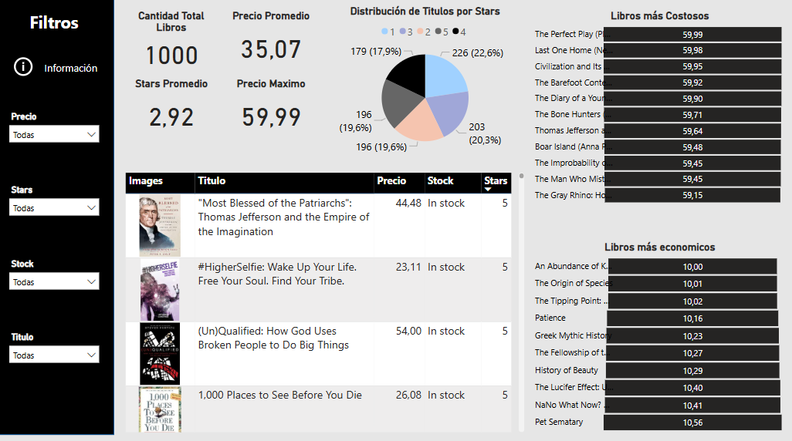
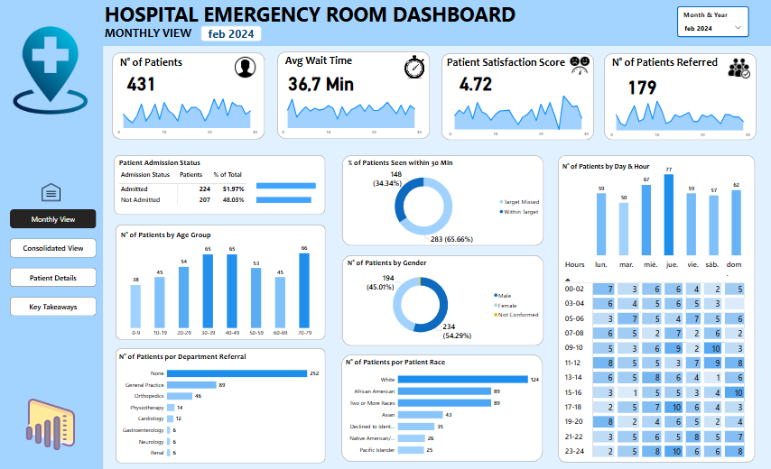
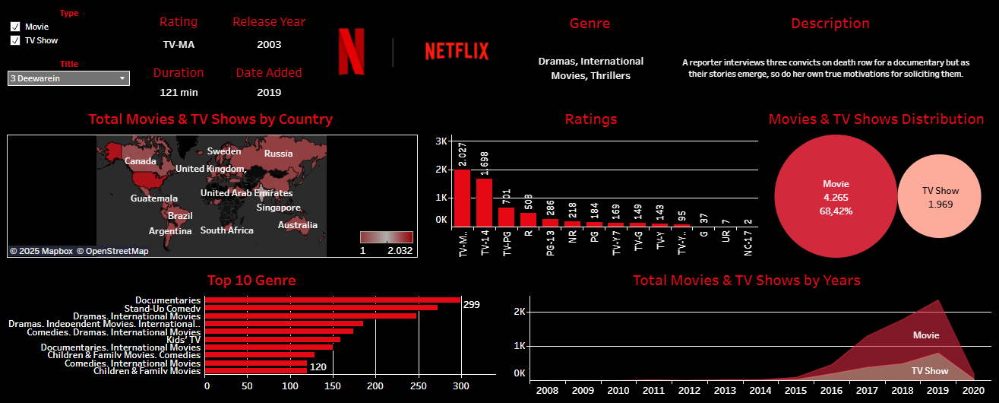
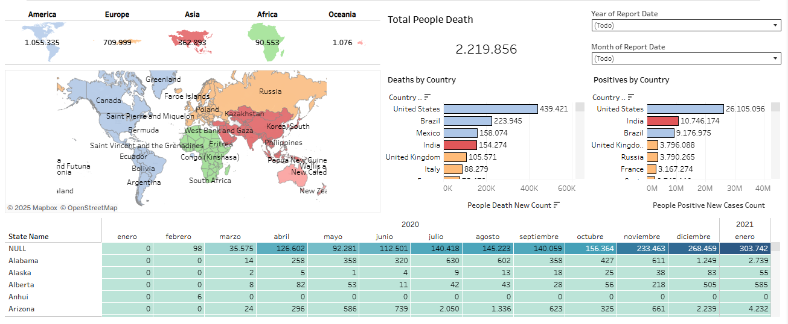
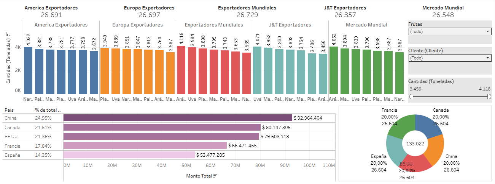
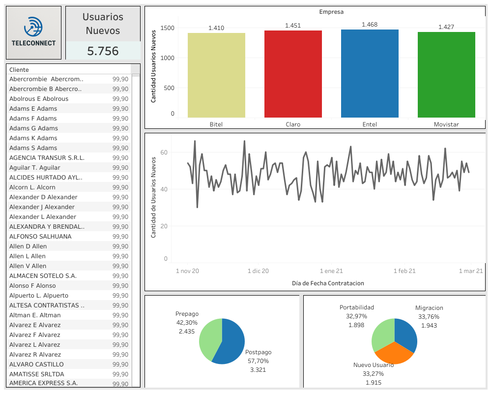
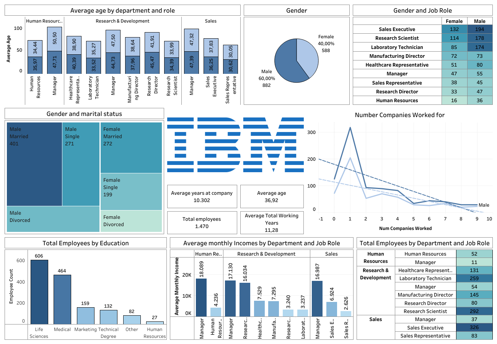

<h1 align="center">Hi, I'm Daniel Sanchez</a> 👋</h1>

## 🚀 About Me  
- 📊 Data Analyst passionate about transforming raw data into meaningful decisions.  
- 💡 Skilled in data visualization, business intelligence, data modeling and data science. 
- 🔍 Strong analytical and problem-solving skills.  
- 🚀 Always eager to learn new technologies and improve my skills.  
- 🌍 Interested in data analytics, data science and machine learning.

## 🛠️ Skills  
- 💻 **Programming Languages:** Python, SQL
- 📊 **Data Analysis:** Excel, Power BI, EDA, Tableau, Google Sheets, DAX, Pandas, NumPy
- 🏗️ **ETL & Data Transformation:** SQL, Power Query
- 📈 **Data Visualization:** Matplotlib, Seaborn, Power BI, Tableau, Excel  
- 🔎 **Machine Learning:** Scikit-Learn
- 🌐 **Web Scraping:** BeautifulSoup, Selenium, Web Driver
- 🛠️ **Other Tools:** Jupyter, Google Colab, Looker Studio  

## 📊 Projects

## 📚 Libros (Web Scraping)

-Este proyecto combina web scraping en Python y visualización de datos con Power BI para analizar una tienda online de libros. Se recolectaron automáticamente datos como el título, la imagen de portada, el precio, la disponibilidad en stock y la valoración en estrellas de 1000 libros.

- Una vez procesada la información, se integró con Power BI para construir un dashboard interactivo que permite:
- Visualizar la distribución de libros según sus valoraciones.
- Identificar los libros más costosos y más económicos.
- Explorar datos detallados como precios, stock y valoraciones por título.
- Aplicar filtros por precio, estrellas, disponibilidad y nombre del libro.

### 📁 Archivos del proyecto

📘 [Proyecto libro_scraping.ipynb](./Proyecto%20libro_scraping.ipynb)
📗 [libros_scraping.csv](./libros_scraping.csv)

## 🚗 BMW Sales (2019-2023)

-This interactive Power BI dashboard provides a comprehensive analysis of BMW's global sales between 2019 and 2023. It features visual insights on:

- Monthly revenue and year-over-year comparisons  
- Top-selling and most expensive models  
- Sales distribution by country and sales channel  
- Annual trends in units sold  

The report includes filters by year, month, and weekday, offering a strategic view of market behavior and model performance.

## 🏥 Hospital Emergency Room

- The dataset reveals high patient volumes, moderate satisfaction levels and common referrals to General Practice and Orthopedics. Mondays and late night to early mornings hours are particularly busy. The patient demographics show a diverse age and racial composition, with nearly equal numbers of admitted and non admitted patients. These insights can help optimize resource allocation and improve patient care in the emergency room.

## 🎬 Netflix

  

- This interactive dashboard provides an analysis of Netflix content, highlighting the distribution between movies and TV shows, the most common genres, content ratings, trends over time, and the countries with the highest number of titles. It also includes filters by content type and displays individual details such as duration, release year, and synopsis.

## 🦠 Covid 19

- This dashboard displays the global impact of COVID-19 using an interactive map with data on deaths and positive cases by country. It also includes a monthly breakdown by U.S. states, allowing users to analyze the virus’s evolution over time.

## 🌾 Agro Exportación

  

- Este gráfico muestra un análisis detallado de las exportaciones de frutas, segmentado por diferentes mercados a nivel mundial. Se visualiza la cantidad exportada (en toneladas) por país para diversas frutas (Naranja, Mandarina, Palta, Mango, Plátano, Arándano, Uva, etc.). Adicionalmente, se presenta un ranking de los principales países exportadores a nivel mundial, destacando su porcentaje del total exportado y el monto total en dólares. Este análisis permite identificar los mercados clave, los principales exportadores y la distribución de las exportaciones a nivel global.

## 📡 Telecomunicaciones

- Este Dashboard presenta un análisis de los nuevos usuarios de una empresa de telecomunicaciones (TELECONNECT). Se muestra la cantidad total de nuevos usuarios y un desglose por cliente. Un gráfico de barras compara la cantidad de nuevos usuarios por empresa (Bitel, Claro, Entel, Movistar). Adicionalmente, una gráfica lineal muestra la tendencia diaria de la cantidad de nuevos usuarios durante un periodo específico (noviembre 2020 - marzo 2021). Finalmente, dos gráficos de torta detallan la distribución de los nuevos usuarios por tipo de plan (Prepago vs. Postpago) y por tipo de venta (Portabilidad vs. Migración vs. Nuevo Usuario). Este análisis proporciona una visión general del crecimiento de nuevos usuarios y su distribución por diferentes categorías.

## 📊 IBM

 

 

- This dashboard offers a detailed view of employee demographics and work experience. Data on the average age by department and role, gender distribution, marital status by gender, and the relationship between gender and role are presented. Additionally, it shows the number of companies employees have worked for, differentiated by gender. Information on the total number of employees by education level, the average monthly income by department and role, and the total number of employees by department and role is also included. Key metrics such as the average tenure at the company, the overall average age, and the average total years of work experience complement the analysis.

